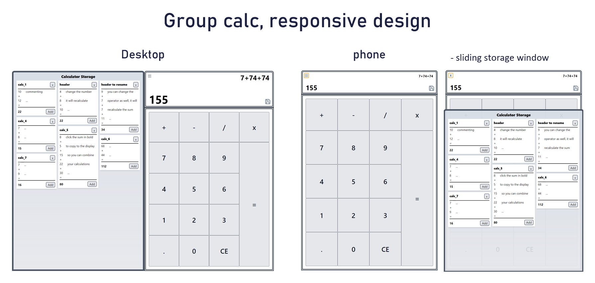
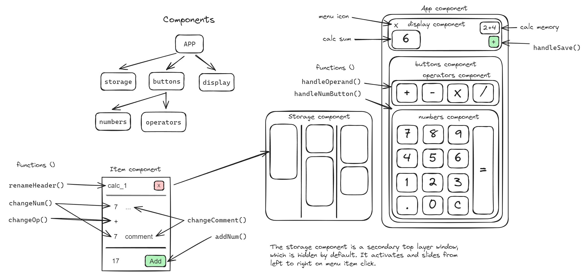

# Group Calculator App



In addition to standard calculator functionality, this app provides the ability to store calculations, including individual numbers. As you input numbers and operators, a save icon appears. By clicking this icon, the entire calculation is saved into an array with each number and operator stored separately.

Upon saving, a new object is created and stored in the app's local storage. Subsequently, a new HTML container is populated with the calculation numbers, operators, and a header in the calculator storage window. The header utilizes a general naming convention "calc_$," followed by the count of items. Clicking on the header activates the renaming function, allowing you to edit the name. After hitting enter or focusing out of the text, the calculation object and HTML are updated, and the local storage object is saved. The original "calc_$" name remains as the object key to preserve sorting.


## Comments
Each number in the calculator item container has three dots next to it, serving as comments for better tracking. Like the header, you can change the dots to text by clicking on them, activating the renaming function. After hitting enter or focusing out, the object and HTML window are repopulated, and the local storage object is saved.


## Numbers
If a mistake is made in the calculation or numbers change over time, you can edit the stored calculation numbers. The function not only makes the number editable but also recalculates the entire container, updating the final sum in the background.


## Adding numbers
The Add button next to the sum number allows you to add a new number to the calculation array with the + operator. This new number can be edited like others, triggering recalculation and updating the stored object and HTML representation.


## Deleting storage items
When removing a calculation with the X button next to the header, the function filters out the calculation object from the global calculator memory object, removes it, and updates the count for consistent naming.


## Combining storage items
Storage calculation items serve as a base for subsequent calculations. Clicking the sum area of the item container copies the sum number to your current calculator display. Close the storage window, add operators and numbers, or revisit the storage to select a different calculation. For instance, combine expense and income calculations to determine the remaining sum.


## Draft layout
Before building the Application, I made a sketch of how the layout of this app should look like to have a better understanding of the components structure and how and where to place the state objects.



# Setup
## Node.js
> Compatibility Note
> Vite requires Node.js version 18+. 20+. However, some templates require a higher Node.js version to work, please upgrade if your package manager warns about it.
[Node.js](https://nodejs.org/en/download/) - Node official download

Install dependencies
```bash
### npm
npm install
```

### Development Server
```bash
npm run dev
```

## React + Vite

This template provides a minimal setup to get React working in Vite with HMR and some ESLint rules.

Currently, two official plugins are available:

- [@vitejs/plugin-react](https://github.com/vitejs/vite-plugin-react/blob/main/packages/plugin-react/README.md) uses [Babel](https://babeljs.io/) for Fast Refresh
- [@vitejs/plugin-react-swc](https://github.com/vitejs/vite-plugin-react-swc) uses [SWC](https://swc.rs/) for Fast Refresh
